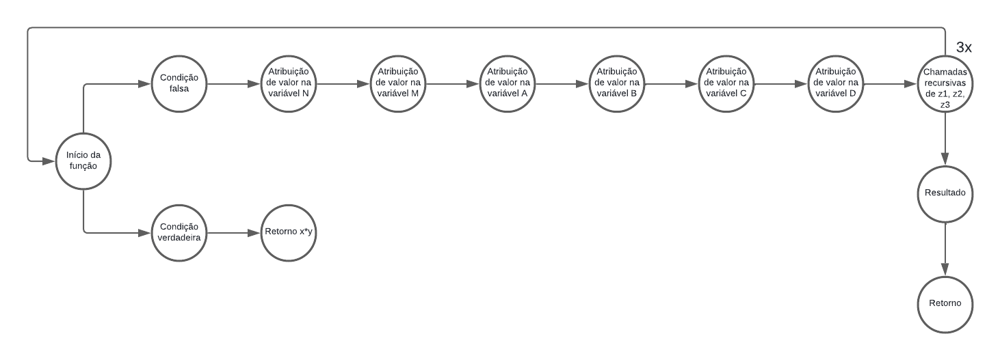

# Algoritmo de Karatsuba em Python

O algoritmo de Karatsuba é uma técnica eficiente para multiplicação de números inteiros grandes, introduzida por Anatoly Karatsuba em 1960. Ele melhora a complexidade da multiplicação em comparação ao método tradicional de multiplicação direta, reduzindo o número de multiplicações necessárias e, consequentemente, o tempo de execução para números com muitos dígitos.

## Implementação do Algoritmo

A implementação inicia-se com a declaração da função recursiva principal do algoritmo de Karatsuba.

```python
   def karatsuba(x, y):
```

A partir disso, inicia-se a implantação da função com a validação do valor. Caso o valor de _x_ ou de _y_ for menor que 10, o valor retornado é a multiplicação entre os dois valores.

```python
    if x<10 or y<10:
        return x*y
```

Logo após, há a obtenção do tamanho do maior número em dígitos e a definição da metade do tamanho para divisão, onde inicia-se o processo de divisão e conquista.

```python
    n = max(tam(x), tam(y)) #a variável n precisa ser o número de dígitos do maior número
    m = n//2 #metade do tamanho para divisão
```

A divisão dos valores de _x_ e _y_ é feita para separar as partes alta e baixa de cada número, facilitando a aplicação recursiva do algoritmo de Karatsuba. Essa separação ocorre da seguinte forma:

```python
    a = x//(10**m)
    b = x%(10**m)
    c = y//(10**m)
    d = y%(10**m)
```

Onde _a_ e _c_ representam os dígitos mais significativos (parte alta) de x e y, respectivamente. São obtidos por uma divisão inteira. E _b_ e _d_ correspondem aos dígitos menos significativos (parte baixa), sendo extraídos com o operador módulo (%).

Posteriormente, há uma recursão para calcular os produtos menores.

```python
    z0 = karatsuba(b,d) #partes mais baixas
    z1 = karatsuba((a+b),(c+d)) #soma das partes
    z2 = karatsuba(a,c) #partes mais altas
```

O último passo dessa função é o cálculo do resultado final combinando os produtos parciais.

```python
    result = z2*(10**(2*m))+(z1-z2-z0)*(10**m)+z0
```

No código, ainda há uma função auxiliar que conta o número de dígitos do maior número.

```python
def tam(x):
    if x<10:
        return 1

    contador = 0
    while x>0:
        x = x//10
        contador += 1

    return contador
```

## Como rodar em ambiente local?

### Passo 1: Clonar o repositório

1. Clone o repositório git em uma pasta no seu ambiente local com o seguinte comando:

   ```bash
   git clone https://github.com/seu-usuario/karatsuba.git
   cd karatsuba
   ```

### Passo 2: Executar o script

1. Execute o script principal:

   ```bash
   python main.py
   ```

2. O programa solicitará que você insira dois números, como:

   ```bash
   Digite o valor de x:
   Digite o valor de y:
   ```

3. O resultado será exibido logo depois.

## Relatório técnico

### Análise da Complexidade Ciclomática

1. **Grafo de fluxo**



2. **Cálculo da complexidade ciclomática**

   - Utilizando a fórmula:  
     \[ M = E - N + 2P \]
     Onde:

     - \(E = 15\) (arestas)
     - \(N = 14\) (nós)
     - \(P = 1\) (número de componentes conexos, pois é um programa único)

     \[ M = 15 - 14 + 2(1) = 3 \]

   - Assim, a complexidade ciclomática do algoritmo é **3**.

### Análise da Complexidade Assintótica

A complexidade do algoritmo de Karatsuba pode ser analisada da seguinte forma:

### Complexidade Temporal

$$
T(n) = 3T(n/2) + O(n)
$$

- Aplicando o **Teorema Mestre**:

$$
T(n) = aT(n/b) + O(n^d)
$$

Onde:

- \( a = 3 \) (três chamadas recursivas)
- \( b = 2 \) (divisão dos operandos ao meio)
- \( d = 1 \) (operações de soma e subtração são \( O(n) \))

$$
T(n) = O(n^{\log_2 3}) \approx O(n^{1.585})
$$

### Complexidade Espacial

- O algoritmo utiliza **memória adicional** para armazenar as chamadas recursivas.
- A profundidade da recursão é

$$
O(\log n)
$$

com três chamadas a cada nível.

- Assim, o espaço utilizado é

$$
O(n^{\log_2 3})
$$

### Casos de Complexidade

- **Melhor caso**: Quando os operandos são pequenos (menos de 10 dígitos), a complexidade é

$$
O(1)
$$

- **Caso médio e pior caso**: Para operandos grandes, segue a complexidade

$$
O(n^{1.585})
$$
